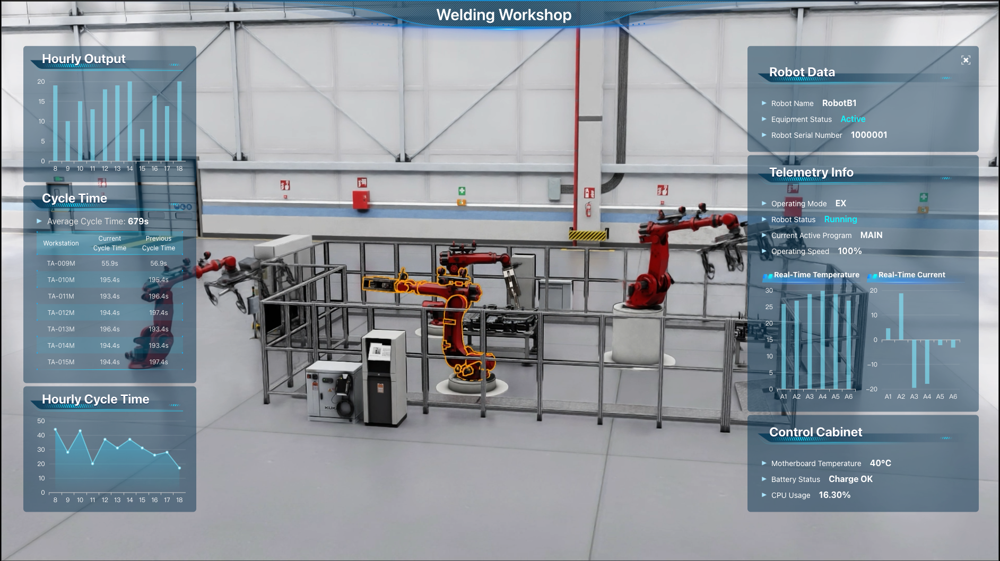

# DataMesh Omniverse Web Viewer Sample Application

<p align="center">
  
</p>

This sample is a Web Viewer data visualization application based on the DataMesh digital twin platform and NVIDIA Omniverse. It demonstrates how to use the DataMesh digital twin platform with NVIDIA Omniverse to render digital twin scenes and visualize data in a web client.

This sample is built as a Vue application using the VueJS framework ([https://vuejs.org/](https://vuejs.org/)).

## Prerequisites

- Install Node.js and npm.
- Chromium browser.
- Install the [Omniverse Nucleus](https://docs.omniverse.nvidia.com/nucleus/latest/enterprise/installation/install-ove-nucleus.html).
- Install the [USD Viewer Streaming Application](https://github.com/NVIDIA-Omniverse/kit-app-template/tree/main/templates/apps/usd_viewer).

## Service Configuration

Before running this sample application, you need to configure the following:

1. Open the [src/typings.d.ts](src/typings.d.ts) to define the global configuration property types.
You can add additional properties as needed.

2. Open the [public/config.js](public/config.js) configuration file. 
Any newly added properties must correspond to the global configuration property types.

3. Locate the `streamServer` variable in `DASHBOARD_CONFIG` and set its value to the service address of the [USD Viewer Streaming Application](https://github.com/NVIDIA-Omniverse/kit-app-template/tree/main/templates/apps/usd_viewer).

4. Locate the `sceneId` variable in `DASHBOARD_CONFIG` and set its value to the scene ID based on the FactVerse platform.

5. Locate the `simulatedId` variable in `DASHBOARD_CONFIG` and set its value to the Record ID obtained from the FactVerse platform.

```javascript
window.DASHBOARD_CONFIG = {
  streamServer: '192.168.24.150',
  sceneId: '7ad1228fb9e044528ea0e0c0beebd110',
  simulatedId:'',
  panelId: '044cb53f7c76573d0682022fb78e890a',
}
```

## Running the Application

This section explains how to run this sample application locally in development mode.

1. Ensure that you meet the [Prerequisites](#Prerequisites)

2. Start the USD Viewer Streaming Application created based on the DataMesh digital twin platform.

3. Clone this sample to your local machine:

```
git clone https://github.com/datameshops/DataMesh-Omniverse-Web-viewer-sample.git
```

4. Navigate to the root directory of this sample application:

```
cd DataMesh-Omniverse-Web-viewer-sample
```

5. Install npm dependencies:

```bash
npm install
```

6. Run the following command to start the application:

```bash
npm run dev
```

Open a browser and visit http://localhost:8080/

## Web Client Development

This sample is built using the VueJS framework and employs NVIDIA Omniverse as the data visualization component. The digital twin scene data is transmitted via the MQTT protocol with DataMesh DFS. Once the data is received, it is visualized and displayed using Echarts.

### Component Library

The following components are primarily used in this sample application:

- [NVIDIA Omniverse](https://github.com/NVIDIA-Omniverse/web-viewer-sample): A component for data visualization.
- [MQTT.js](https://github.com/mqttjs/MQTT.js): A JavaScript client for the MQTT protocol.
- [Echarts](https://echarts.apache.org/zh/index.html): A component for visualizing charts.

### NVIDIA Omniverse

To embed Omniverse Viewer into the web client, you need to add `omniverse-webrtc-streaming-library` as a dependency to the project:

- Refer to the `@nvidia:registry` configuration in [.npmrc](.npmrc).
- Refer to the `dependencies` section in [package.json](package.json).

#### AppStreamer

The most important part of this example is the [./src/components/AppStreamer.vue](./src/components/AppStreamer.vue) file, which is based on the `omniverse-webrtc-streaming-library` and uses the `AppStreamer` class. `AppStreamer.vue` provides a reference implementation for initializing the stream and enabling bi-directional messaging between the web client and the Kit application.

#### Initialize the Stream

The `connect()` function of `AppStreamer` is used to initialize the stream and messaging. You need to provide a `streamConfig`object containing configuration settings, along with a set of functions to handle the messages.

#### Custom Messages

When using `AppStreamer` and custom messages, there are two key points to note:

- `AppStreamer.sendMessage()` is used to send custom messages.
- The stream configuration data passed to `AppStreamer` (`RagnarokConfig` or `GFNConfig`) allows you to register a handler for incoming messages via `onCustomEvent` ([view code example](./src/components/AppStreamer.vue#L65)).

#### Message Format

The message format between `AppStreamer` and the web client is a JSON object string containing `event_type` and `playload`. The structure of the message is as follows:

```typescript
{
    event_type: "myEvent",
    payload: {
        property_name  : value
    }
}
```

On the receiving end, the Kit application requires an extension to handle `myEvent` and its `payload`。The Kit application sends similar messages to the client for processing. Below, we explore how messages are used to open a USD scene in this solution.

#### Sending Custom Messages

Messages sent by `AppStreamer` are JSON strings. To ensure that your custom Kit extension based on `omni.kit.livestream.messaging` can process these messages, you need to follow the message format mentioned above.

Example:

```typescript
//
  const settings_message: AppStreamMessageType = {
    event_type: 'setAdaptorConfigRequest',
    payload: {
      token: APP_CONFIG.OMNIVERSE.TOKEN,
      account_id: '',
      password: '',
      nucleus_ip: APP_CONFIG.OMNIVERSE.NUCLEUS_IP,
      server_url: APP_CONFIG.OMNIVERSE.SERVER_URL,
    },
  }

```

Then, serialize the message object into a JSON string and send it using `AppStreamer.sendMessage()`.

```typescript
AppStreamer.sendMessage(JSON.stringify(message))
```

The [DashboardView.vue](src/views/DashboardView.vue#L55) file in this sample provides an example of sending messages.

#### Receiving Custom Messages

When using `AppStreamer.connect()` to register a custom event handler, you need to provide a function to process incoming messages. This function should receive a message object that contains both `event_type` and `payload`.


```typescript
const handleCustomEvent (event: any): void {
  // Initialize FactVerse scene
  if (event.event_type === 'openAdaptorResponse') {
    // Initialize FactVerse scene successful
    if (event.payload.result === 'success') {
      console.log('FactVerse scene initialized successfully')
    }
  }
}

```

#### Execution Order
When registering custom event handlers using `AppStreamer.connect()`, the initialization process follows this sequence:
1. Initialize adaptor configuration

	Send a `setAdaptorConfigRequest` to initialize the adaptor configuration.
	
	This request can include either an account/password pair or a login token.
	a) The token can be obtained after configuring TOKEN, NUCLEUS_IP, and SERVER_URL in `src/utils/mqtt.ts`
	b) Once the configuration is prepared, send the initialization request using `AppStreamer.connect()`.
	
2. Handle initialization response

	After sending the request, the client receives a `setAdaptorConfigResponse` event.
	
	This event indicates the result of the initialization process.
	
	Receiving this response means the adaptor configuration has been successfully applied.
	
3. Open the digital twin scene

	After successful initialization, send an `openDTSceneRequest` to open the scene.

	The scene-related parameters (such as sceneId and simulatedId) are configured in [public/config.js](public/config.js) 

	The `openAdaptorResponse` event is used to handle the result of the scene-opening request.

	Receiving this response indicates that the scene has been opened successfully.
	
```typescript


  const settings_message: AppStreamMessageType = {
    event_type: 'setAdaptorConfigRequest',
    payload: {
      token: APP_CONFIG.OMNIVERSE.TOKEN,
      account_id: '',
      password: '',
      nucleus_ip: APP_CONFIG.OMNIVERSE.NUCLEUS_IP,
      server_url: APP_CONFIG.OMNIVERSE.SERVER_URL,
    },
  }
const handleCustomEvent (event: any): void {
    if (event.event_type === 'setAdaptorConfigResponse') {
    //Open scene using sceneId and simulatedId defined in config.js
    const open_message: AppStreamMessageType = {
      event_type: 'openDTSceneRequest',
      payload: {
        scene_id: window.DASHBOARD_CONFIG.sceneId,
        record_id: window.DASHBOARD_CONFIG.simulatedId,
      },
    }
    appStreamerRef.value?.sendMessage(JSON.stringify(open_message))
  }
  // Initialize FactVerse scene
  if (event.event_type === 'openAdaptorResponse') {
    // Initialize FactVerse scene successful
    if (event.payload.result === 'success') {
      console.log('FactVerse scene initialized successfully')
    }
  }
}
```

The [DashboardView.vue](src/views/DashboardView.vue#L77) file in this sample provides an example of handling messages.

## License

This project downloads and installs other third-party open-source software. Please review their license terms before using them.
